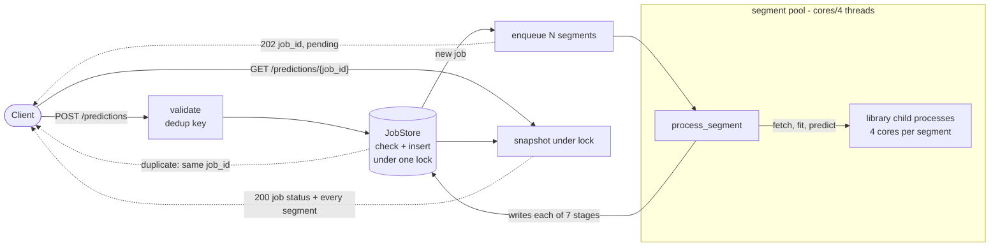

# Pythia prediction service — design

A job is a set of segments. The API only ever creates jobs and reads them; every
second of compute happens elsewhere.

| Component      | Does                             | Today                                       | Later              |
| -------------- | -------------------------------- | ------------------------------------------- | ------------------ |
| API (FastAPI)  | validate, create, read           | async handlers, no work inline              | unchanged          |
| JobStore       | job + segment state, dedup index | dict + `threading.Lock`                    | Redis or Postgres  |
| Segment pool   | runs segments                    | `ThreadPoolExecutor`, size `cores // 4` | Celery/RQ + broker |
| Pythia adapter | the only import of the library   | v1; v2 is a two-line change                 | unchanged          |

**Threads, not processes.** `modeling.fit_*` already opens its own
`multiprocessing.Pool`, so a fit is a blocking wait here and frees the GIL. A
`ProcessPoolExecutor` would also fail outright: multiprocessing workers are
daemonic and cannot have children. Each segment still costs 4 cores inside the
library, so pool size is the one lever on machine load, hence `cores // 4`
(2 on an 8-core box). Threads also make per-stage progress free: the worker and
the store share memory, so no IPC is needed to report it.

**Status is derived, never stored.** `derive_job_status()` rolls segment states
up on every read. A stored copy drifts the first time an update path forgets to
refresh it. Corollary: a terminal status only appears once nothing is in flight,
and a job with nothing started reports `pending` rather than pretending to run.

**Dedup is not a cache.** The key is a hash of the sorted
`(games, regions, platforms)`, indexed only while the job is active. A second
identical submission joins the running job; one that arrives after it finished
gets a fresh job. Caching results would need an invalidation story (how often
does BigQuery refresh? which model version produced this?) that belongs to a
later design, not to this one.

## When things go wrong

| Failure                      | Behaviour                                                                                                                                                                               |
| ---------------------------- | --------------------------------------------------------------------------------------------------------------------------------------------------------------------------------------- |
| One segment fails            | Isolated. Segment records `failed_stage` + message; siblings finish; job ends `partial_success`.                                                                                     |
| Every segment fails          | Job ends `failed`. Unknown segment surfaces as `KeyError: No data configured...` at `fetching_players`.                                                                            |
| Same request twice in flight | Second caller gets the same `job_id` with `deduplicated: true`. Only the creator schedules work.                                                                                     |
| Shutdown mid-flight          | Queued segments are cancelled, running ones are awaited. Anything left unscheduled is marked failed, so the job stays terminal and the dedup key is released; that request answers 503. |
| Request too large            | Rejected with 422 before anything is created. The cap is `PYTHIA_MAX_SEGMENTS` (64).                                                                                                   |
| Process dies                 | Everything is lost: state is in memory. This is the first thing persistence buys.                                                                                                       |

Two endpoints beyond the brief earn their keep: `GET /predictions` (summaries,
newest first, `limit` mandatory) and `GET /stats` (pool size, pending and
running segments). Without them, "what is the service working on, and is my
job queued or stuck?" is only answerable by reading logs.

Observability is per event: `job_accepted`, `segment_started` (with `queued_s`,
the backpressure signal), `segment_succeeded` (with `duration_s`),
`segment_failed` (with traceback), `job_finished`. Queue time and compute time
are separate fields, so "slow job" is answerable without a profiler.

## Limits worth stating

- **One worker.** In-memory state pins the service to a single process. Multiple
  uvicorn workers would 404 each other's jobs and dedup nothing.
- **Concurrency is bounded by the machine, not by the design.** 20 simultaneous
  requests are accepted and isolated, but 8 cores only run 2 segments at a time;
  the rest queue. Real headroom means horizontal scale, which is what the store
  and pool seams are for.
- **No global admission control.** The per-request cap bounds one request, not
  total load; a 429 on queue depth is the missing piece.
- **No per-segment timeout and no retry.** A hung fetch would hold a pool slot
  indefinitely, and Python cannot kill the thread; freeing the slot needs
  process isolation or a timeout in the library.
- **Pool slots idle during I/O.** Roughly a third of each segment is BigQuery
  wait. Splitting I/O and CPU into separate pools would recover it.

Measured on 8 cores: 8 segments end to end in ~83s against ~216s sequential;
values match `example-results.csv`. Part 2's script, same catalog on library v2,
runs 905s → 182s. Both numbers move with CPU power state.
